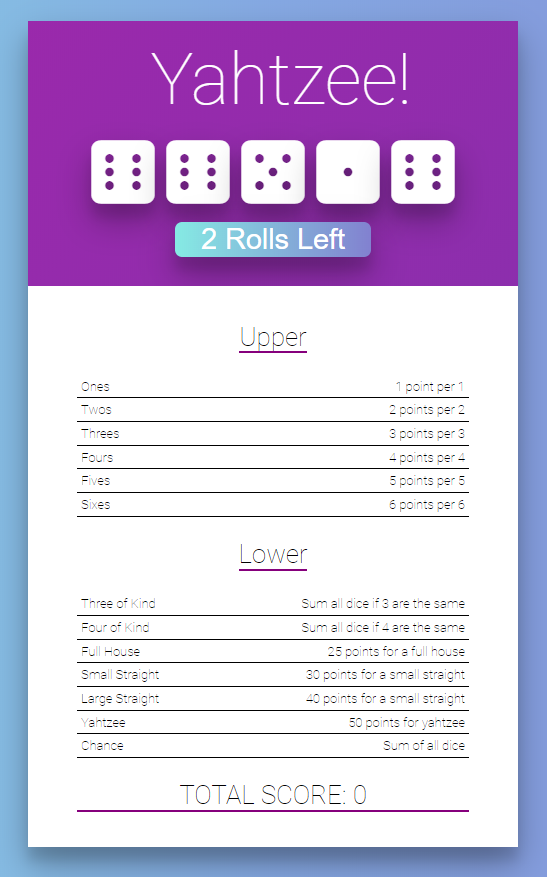

## React Yahtzee

A React project from Colt Steele starter file from Udemy - [The Modern React Bootcamp](https://www.udemy.com/course/modern-react-bootcamp/).
Starter file had incomplete game, I learned how to work with another users' code and fixed various bugs:

- State logic to run the game
- Dice rolling
- Score description addition
- I added flexbox to the table to fix app and made it mobile friendly!

  <a href="https://kien-react-deckofcards.netlify.com/">Live Demo</a>

  

## 👨‍🎓What I learned:

- Worked with a pre-existing codebase developed by someone else
- Walked through step by step logic to slowly understand what is being accomplished
- Learned how `Sets` are used in JavaScript
- How to play Yahtzee!
